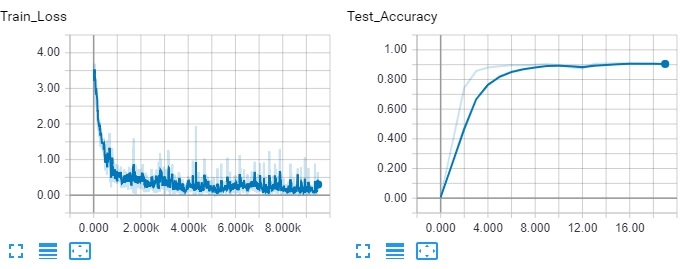

# IT-Language-Understading
Deep Learning toolkit for Italian Natural Language Understanding
<br><br>

#### Data Source
https://github.com/UniversalDependencies/UD_Italian-ISDT

#### Word embedding
This model require Fasttext or another word embedding <br>
https://fasttext.cc/docs/en/crawl-vectors.html

#### Word embedding to Sqlite:
Sqlite provide fast access to word vectors reducing main memory usage
```
usage: embed_to_sqlite.py [-args]

arguments:
  --word_embed        Word embedding file (bin)
  --output            Output sqlite database
```

### How to use

```
usage: train.py [-args]

arguments:
  --train_data        Train dataset
  --test_data         Test dataset
  --json              Tags json
  --tag               Tag to predict
  --word_embed        Word embedding db
  --word_embed_size   Word embedding vectors size
  --save_model        Save model to file
  --load_model        Load model from file
  --validation        Compute accuracy (Bool)
  --eval              Tag the provided sentence
```

### Train


### UPOS tagging

##### Test accuracy: 90.70%

```
train.py --load_model="./checkpoint/upos.pt" --tag="upos" --eval="Asimov scrisse... antologia."
```

##### Sentence: <br>
Asimov scrisse diversi racconti degni di nota, molti riguardanti i robot positronici e il Multivac racchiusi nell'antologia.

##### Output: <br>
Asimov : PROPN scrisse : VERB diversi : ADJ racconti : NOUN degni : ADJ di : ADP nota : NOUN , : PUNCT molti : DET riguardanti : VERB i : DET robot : NOUN positronici : ADJ e : CCONJ il : DET Multivac : NOUN racchiusi : ADJ nell'antologia : PROPN . : PUNCT


### XPOS tagging

##### Test accuracy: 90.63%

```
train.py --load_model="./checkpoint/xpos.pt" --tag="xpos" --eval="Asimov scrisse... antologia."
```

##### Sentence: <br>
Asimov scrisse diversi racconti degni di nota, molti riguardanti i robot positronici e il Multivac racchiusi nell'antologia.

##### Output: <br>
Asimov : SP scrisse : V diversi : A racconti : S degni : B di : E nota : S , : FF molti : B riguardanti : V i : RD robot : S positronici : A e : CC il : RD Multivac : S racchiusi : A nell'antologia : SP . : FS
